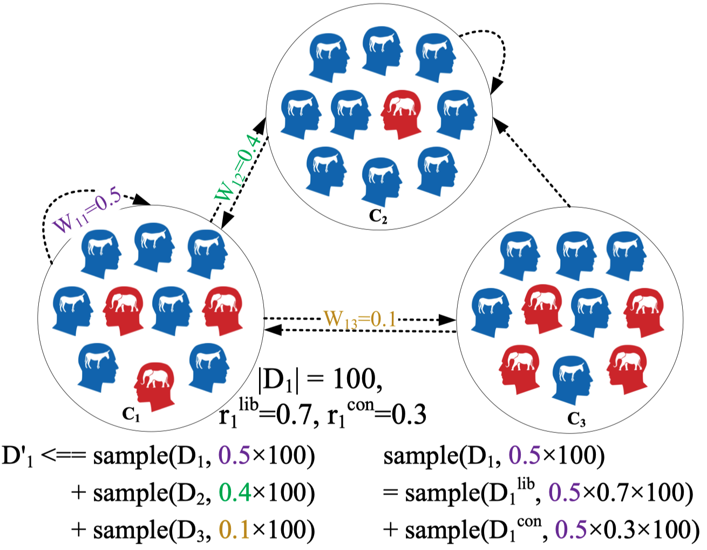

# Deciphering Ideological Stances of Interconnected Mixed-Ideology Communities
This repo is the implementation of our [paper](https://arxiv.org/abs/2402.01091) "Reading Between the Tweets: Deciphering Ideological Stances of Interconnected Mixed-Ideology Communities", where we propose a method to adapt language models to the ideologies of interconnected mixed-ideology communities.


## Message Between Community Corpora


Illustration of message passing of community $C_1$ in a simplified retweet network with three communities. The source node of an edge is the retweeting community, and the target node is the retweeted community. $D_1$ (the corpus of $C_1$) contains 100 tweets, where the fraction of liberal and conservative tweets are 0.7 and 0.3 respectively. The normalized out degrees for community $C_1$ are shown on its out edges. At each step of message passing, community $C_1$ exchanges information and updates its corpus with its neighboring communities including itself, based on its retweeting activities. The numbers of liberal and conservatives tweets sampled from the neighbors are based on the existing ration within $C_1$.


## (Optional) Data Downloading
1. Download the [tweets](https://drive.google.com/file/d/1PaZ9sHhP-qnsctZ5V_qQy482fO-v7QZJ/view?usp=sharing) and put it under *data/*.
2. Download the community [finetuning corpora](https://drive.google.com/file/d/1Q7QJ2CVxg0P-Rdzc-oMlyz3RcVp4wnbs/view?usp=sharing) and put it under *data/*.
3. Download the model [checkpoints](https://drive.google.com/file/d/1N0ZQ72rv-ckrBwHjpCS-Dz6yXYYdbxrw/view?usp=share_link) and put it under *02_model_finetuning/*.
4. Download the [generated opinions](https://drive.google.com/file/d/1PIcBhBQLUNvPSkG4wMcZwibrYZhY6qln/view?usp=sharing) and put it under *03_text_inference*.
5. Download the [stance scores](https://drive.google.com/file/d/1PRUUTDPp0AJj___ne2VnxOVMa59O41iq/view?usp=sharing) and put it under *04_eval_stances*.

## Experiments

### (Optional) Message passing
Construct the community retweet network, run message passing, and prepare the corpora.
```angular2html
cd 01_data_preparation
python corpus_message_passing
```

### (Optional) Model finetuning
Finetune the models for all communities (1-20), including the baseline models without message passing and our proposed method with message passing, controlled by *mp*.
```angular2html
cd 02_model_finetuning
python run_train.py
```

### (Optional) Opinion generation
For each community, each target, each prompt, and each random seed, generate 1000 responses from the finetuned model.
```angular2html
cd 03_text_inference
python 01_run_generation.py
python 02_sample_generations.py
python 03_agg_generations.py
```

### (Optional) Stance detection / Sentiment analysis
Infer the stances (sentiments) from the generations.
```angular2html
cd 04_eval_stances
python 01_split_chunks.py
python 02_run_infer_stance.py
python 03_merge_stances.py
```

### Evaluation
Evaluate the performance on target-specific community ranking and community-specific target ranking.
```angular2html
cd 05_results_analysis
python run_target_sp_comm_ranking.py
python run_comm_sp_target_ranking.py
```

## Citation
```bibtex
@misc{he2024reading,
      title={Reading Between the Tweets: Deciphering Ideological Stances of Interconnected Mixed-Ideology Communities}, 
      author={Zihao He and Ashwin Rao and Siyi Guo and Negar Mokhberian and Kristina Lerman},
      year={2024},
      eprint={2402.01091},
      archivePrefix={arXiv},
      primaryClass={cs.CL}
}
```